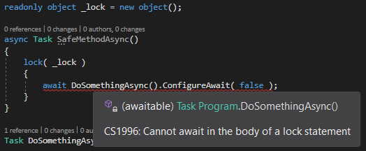

# An Asynchronous Lock that handles reentrancy

Locking in the asynchronous world may be surprising if you are used to regular multi threading programming.
Good old constructs like the [Monitor](https://docs.microsoft.com/en-us/dotnet/api/system.threading.monitor) cannot
be used.

## Lock & Asynchronism

---
**Opportunity**

Please read (at least 71616 times) this http://www.albahari.com/threading/. And regarding
Monitors, once you'll master this http://www.albahari.com/threading/part4.aspx#_Signaling_with_Wait_and_Pulse, you'll feel so much better!

----

Using a Monitor like this is not possible and, lucky you, the compiler detects it:



Unfortunately, it won't detect other constructs like when you just want the same lock but with a timeout.
This compiles perfectly well:

```csharp
async Task SafeMethodAsync()
{
    if( Monitor.TryEnter( _lock, 1000 ) )
    {
        try
        {
            await DoSomethingAsync().ConfigureAwait( false );
        }
        finally
        {
            Monitor.Exit( _lock );
        }
    }
}
```

But it will crash. Simply because the Monitor is a "thread-affine" construct. It relies on the 
thread identity (and may be also on the thread local storage) to track its current "owner" and block the others:
the tread that entered the monitor MUST be the one that exit from it otherwise an InvalidOperationException is thrown.

Here, the *await* magic may perfectly temporarily suspend the current execution, unrolling the current stack and
releasing the thread that entered the monitor, and execute the continuation on another thread: the `Exit()` will not be
executed by the entering thread. BAM!

Something else is required.

## The SemaphoreSlim

This beast is one of the most basic construct that handles asynchronous concurrency. It is not equivalent to the
Monitor/Lock seen above. It has no Wait/Pulse mechanism and is a Semaphore rather than just a Mutex[^1].

A Semaphore is a generalized Mutex, it's easy to configure it to be a lock: `_lock = new SemaphoreSlim( initialCount: 1, maxCount: 1 );` 

### WaitAsync()... but beware of reentrancy!

This works great!
```csharp
async Task SafeMethodAsync()
{
    if( await _lock.WaitAsync( 1000 ) )
    {
        try
        {
            await DoSomethingAsync().ConfigureAwait( false );
        }
        finally
        {
            _lock.Release();
        }
    }
}
```

Unfortunately, the code above is dangerous... and it's not obvious (this is why it's actually very dangerous).
The point is that SemaphoreSlim cannot handle reentrancy. And here, "cannot" must be understood in its primary
meaning: SemaphoreSlim is not able to handle reentrancy meaning that it cannot detect it (and throw), it can only 
block... definitely!  

Actually ONE solution exists to detect reentrancy but with a serious price to pay in terms of performances and by opening the doors to subtle (understand _awful_) issues:
using an [AsyncLocal](https://docs.microsoft.com/en-us/dotnet/api/system.threading.asynclocal-1).

We strongly encourage you to NEVER rely on `AsyncLocal`. There are plenty of discussions about this and even if some
disagree, we NEVER use them. See this intersting post https://codeblog.jonskeet.uk/2010/11/08/the-importance-of-context-and-a-question-of-explicitness/
and this (sad) [story](https://github.com/dotnet/aspnetcore/issues/4731).

### Our IActivityMonitor-based answer

This simple [AsyncLock](AsyncLock.cs) relies on the fact that the [IActivityMonitor](IActivityMonitor.cs) flows
into the code, following the current activity. This identify the participant: it is then trivial to control "who"
is calling and to react the way we want thanks to the standard [LockRecursionPolicy](https://source.dot.net/#System.Private.CoreLib/ReaderWriterLockSlim.cs,10). 

To ease debugging and maintenance (concurrency is hard), this lock has a name that defaults to the source location of
where it has been new'ed (source file name and line number). And, since a `IActivityMonitor` is available, logs are
emitted when entering/leaving the lock.

[^1]: A Mutex (Mutual Exclusion) is like a car with only one seat: no more that one participant can enjoy the trip.
A Semaphores is a car with multiple seats: you can choose the number of seats, letting multiple participants playing
simultaneously inside the car.

