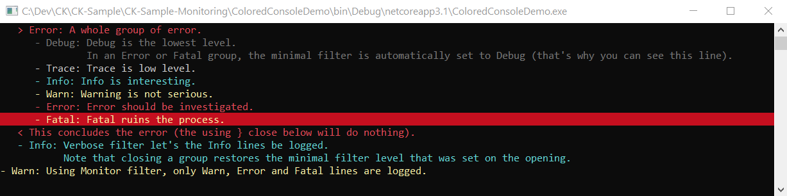

# ActivityMonitor clients

The `IActivityMonitor` is the collector of the logs that
are routed to any number of clients that can be registered onto its [Output](../IActivityMonitorOutput.cs).

The design of the Output and its Clients allows very different kind of
clients to coexist, that can support funny patterns like counting errors that may
occur anywhere in subordinated calls:

```csharp
int errorCount = 0;
using( monitor.OnError( () => ++errorCount ) )
{
    monitor.Info( "This is not an error." );
    await SafeCodeAsync( monitor );
    monitor.Error( "Ouch! (I'm the only error)." );
}
errorCount.Should().Be( 1 );

```

The `OnError` extension method above uses the [ActivityMonitorErrorCounter](ActivityMonitorErrorCounter.cs) client
by registering it onto the `Output` and unregistering it when leaving the using scope.

Other clients like the [ColoredActivityMonitorConsoleClient](ColoredActivityMonitorConsoleClient.cs) routes
and/or displays the received stream of logs:



```csharp
static void Main( string[] args )
{
    var m = new ActivityMonitor( topic: "I'm full of colors (and I'm playing with levels and filters)." );

    m.Output.RegisterClient( new ColoredActivityMonitorConsoleClient() );

    m.MinimalFilter = LogFilter.Terse;
    using( m.OpenInfo( $"Let's go: the actual filter is {m.ActualFilter}." ) )
    {
        m.Info( "In Terse filter, only Info (and above) groups and only Error or Fatal lines are logged. So you won't see this." );

        using( m.OpenError( "A whole group of error." ) )
        {
            m.Debug( "Debug is the lowest level." );
            m.Debug( $"In an Error or Fatal group, the minimal filter is automatically set to {m.ActualFilter} (that's why you can see this line)." );
            m.Trace( "Trace is low level." );
            m.Info( "Info is interesting." );
            m.Warn( "Warning is not serious." );
            m.Error( "Error should be investigated." );
            m.Fatal( "Fatal ruins the process." );

            m.CloseGroup( "This concludes the error (the using } close below will do nothing)." );
        }
        m.MinimalFilter = LogFilter.Verbose;
        m.Info( "Verbose filter let's the Info lines be logged." );
        m.Info( "Note that closing a group restores the minimal filter level that was set on the opening." );
    }
    Debug.Assert( m.ActualFilter == LogFilter.Terse );
    m.MinimalFilter = LogFilter.Monitor;
    m.Warn( "Using Monitor filter, only Warn, Error and Fatal lines are logged." );

    System.Console.ReadLine();
}
```

This sample is available in the [CK-Sample-Monitoring](https://github.com/signature-opensource/CK-Sample-Monitoring) repository.


