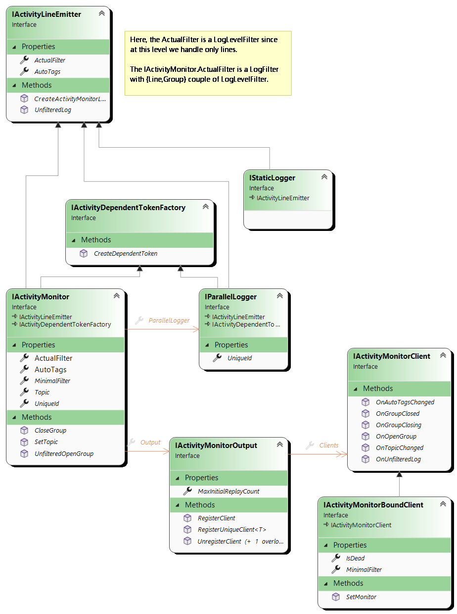

# ActivityMonitor implementation & design

## No AmbientContext

The design of this library is all about fighting the implicit "Ambient Context" that too many libraries use (the worst word
in this sentence being **implicit**).

A `IActivityMonitor` follows the current executing context: it appears as a parameter in a lot of methods.
This is clearly an API pollution. Yes... but this is the only way to be explicit and not rely on implicit context.

An Implicit (also named Ambient) Context requires specific mechanism to be able to "follow the code path".
There is basically two such mechanisms: TLS and AsyncLocal.

### Thread Local Storage (good old synchronous world)

This one is easy, safe, and rather efficient. [Wikipedia](https://fr.wikipedia.org/wiki/Thread_Local_Storage) explains
it well. In C#, this is as simple as using the [ThreadStatic attribute](https://learn.microsoft.com/en-us/dotnet/api/system.threadstaticattribute)
Numerous historical logging framework used this to enrich the logs with contextual information, to structure the logs (by
opening "scopes"). This was easy, lock-free by design and "magical".

Unfortunately this cannot be used as soon as the code enter the asynchronous world, for the same reason as
why a [classical lock doesn't support await](AsyncLock.md).

### The AsyncLocal in the asynchronous world

The [async locals](https://docs.microsoft.com/en-us/dotnet/api/system.threading.asynclocal-1) is functionally equivalent
to thread static in the asynchronous world.

Unfortunately, this is much more complex and less efficient than TLS: the information that must "follow the code" is
encapsulated in an `ExecutionContext`, a kind of associative map whose implementation is deeply rooted in the framework.
Below a piece of [source](https://source.dot.net/#System.Private.CoreLib/src/libraries/System.Private.CoreLib/src/System/Threading/AsyncLocal.cs,ef9ce034697240ba):
```c#
    /// <summary>
    /// Interface used to store an IAsyncLocal => object mapping in ExecutionContext.
    /// Implementations are specialized based on the number of elements in the immutable
    /// map in order to minimize memory consumption and look-up times.
    /// </summary>
    internal interface IAsyncLocalValueMap
    {
        bool TryGetValue(IAsyncLocal key, out object? value);
        IAsyncLocalValueMap Set(IAsyncLocal key, object? value, bool treatNullValueAsNonexistent);
    }
```
Contrary to the `SynchronizationContext`, suppressing the flowing of this context is not as easy as calling `ConfigureAwait(false)`
because since "some code somewhere" may need this hidden context, it is considered too dangerous to be exposed (it can
still be [suppressed](https://learn.microsoft.com/en-us/dotnet/api/system.threading.executioncontext.suppressflow)).

The good news is that as long as this context is not used (ideally remains empty), the overhead is rather small. But
overusing `AsyncLocal<T>` will definitely cost.

To understand difference (and unfortunate coupling) between ExecutionContext and SynchronizationContext, read [this post from Stephen Toub](https://devblogs.microsoft.com/pfxteam/executioncontext-vs-synchronizationcontext/).

## Local Clients first

An `ActivityMonitor` first collects its received logs locally (and synchronously) and dispatch them to its
registered [`IActivityMonitorClient`](IActivityMonitorClient.cs).

A Client can be temporarily registered and act as a local log interceptor that can provide information to the call
site. In this scenario, an ActivityMonitor can be used as a kind of information channel between the callees up to their
caller. 

This is described in more details in [Client](Client/README.md).

## Standard LogFilter names
A [LogFilter](LogFilter.cs) must apply to Groups of logs and to Lines of logs. It can be expressed as **{Group,Line}** strings
like `"{Error,Trace}"` or predefined couples `"Debug"`.

A `LogFilter` is usually used as a "Minimal Filter": multiple participants declare their "MinimalFilter" and the resulting filter
is the lowest one: combining 2 LogFilters results in a `LogFilter` that satisfies both of them: “{Error,Trace}” combined
with “{Warn,Warn}” is “{Warn,Trace}”.

[LogClamper](LogClamper.cs) enables a `LogFilter` to act as a strong filter.
More on this [here](Impl/TagFiltering.md).

### .Net standard conventions
The standard LogFilter have been defined based on the [recommended verbosity option for command lines](https://learn.microsoft.com/en-us/dotnet/standard/commandline/syntax#the---verbosity-option).

|   Name    |     Description   |
|-----------|-------------------|
|`Diagnostic` |`{Debug,Debug}` Everything is required.|
|`Detailed`   |`{Trace,Trace}` OpenTrace and Trace appear but no OpenDebug nor Debug lines.|
|`Normal`     |`{Trace,Warn}` OpenTrace and Fatal, Error or Warn lines appear. This may be still a little "verbose" but captures key information. |
|`Minimal`    |`{Info,Warn}` OpenInfo and Fatal, Error or Warn lines appear. Minimal should have enough context to understand issues. |
|`Quiet`      |`{Error,Error}` Only errors are considered. This is our "minimal": errors should never be hidden. |

To this list, the `Fatal` that is the strongest filter (`{Fatal,Fatal}`) is added. It should be avoided.

### Other names
Before this recommendation appears we used:

|   Name    |     Description    |
|-----------|--------------------|
|`Debug`      | `{Debug,Debug}` |
|`Trace`      | `{Trace,Trace}`|
|`Verbose`    | `{Trace,Info}` |
|`Monitor`    | `{Trace,Warn}` |
|`Terse`      | `{Info,Warn}`  |
|`Release`    | `{Error,Error}`|

Those names are supported but the .Net standard ones should be preferred.

## IStaticLogger, IParallelLogger and IActivityMonitor
The `IStaticLogger` is exposed by the static `ActivityMonitor.StaticLogger` property. It is close to
more classical logging solutions: only lines can be emitted by any thread at any time and its emitted lines
are not structured (their Depth is always 0).
Since it exposes an `AutoTags` and an `ActualFilter`, any filtering/sender extension methods are possible.

The `IParallelLogger` is like the static logger but is bound to a monitor: lines emitted by a parallel logger
are bound to the originating `IActivityMonitor`: even if this is a thread safe logger, the log time
and the depth (in opened groups) are synchronized with the monitor states.
- The LogTime uniquely identify the log line for the monitor identifier.
- The line Depth is accurate regarding the opened groups at the time the log is emitted.
It sends its log lines through the <see cref="ActivityMonitor.OnStaticLog"/> event,
not through the `IActivityMonitor.Output`: the logs ordering relative to the monitor is preserved BUT these thread safe
logs cannot be observed by the monitor's output `IActivityMonitorClient`.

A `IParallelLogger` can create DependentToken since it is bound to its monitor.

The [`IActivityMonitor`](IActivityMonitor.cs) interface is a logger that groups and, more importantly, the `Output`
where `IActivityMonitorClient` listeners/sinks can be registered and unregistered.

For a monitor to expose a non null `IActivityMonitor.ParallelLogger`, the `ActivityMonitor` constructor must
be called with the [`ActivityMonitorOptions.WithParallel`](ActivityMonitorOptions.cs) option.



